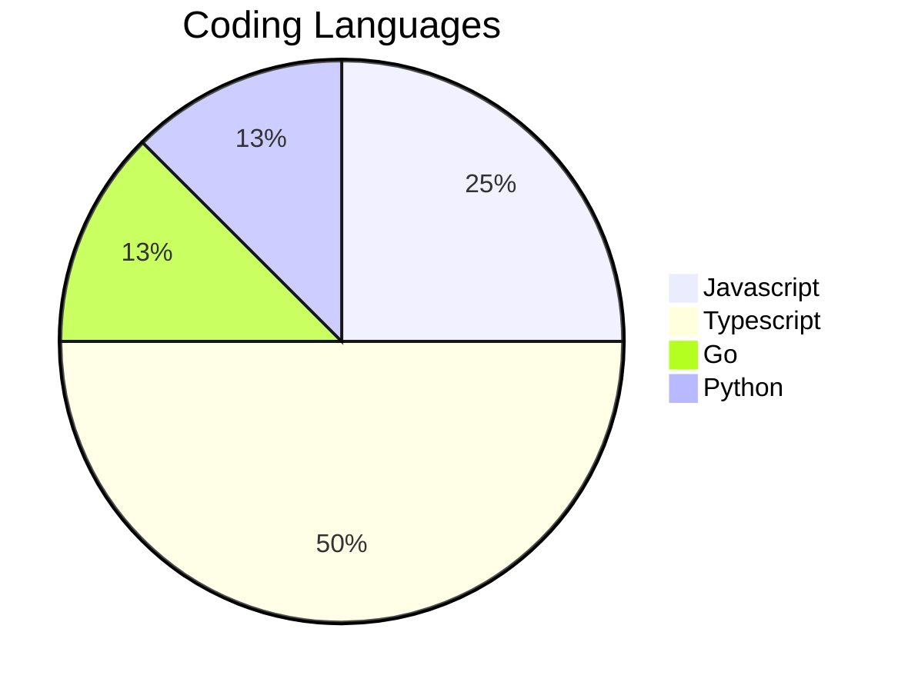
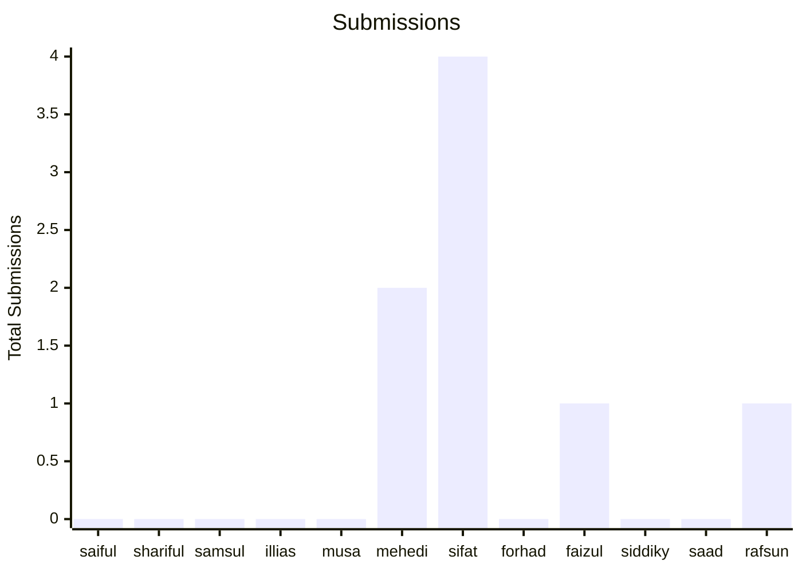

# QP Weekly Coding Challenge

## Introduction

This is a weekly coding challenge to help you practice your coding skills.

## Rules

- You can use any programming language you want.
- Solving without using any helper functions is encouraged.
- You can use any data structure you want.

## Submission

- Fork this repository.
- Create a new branch.
- Create a new folder with your name in the appropriate folder.
- Add your code in the folder.
- Add a screenshot of your result.
- Commit your changes.
- Push your branch.
- Create a pull request.

## Some Analytics

